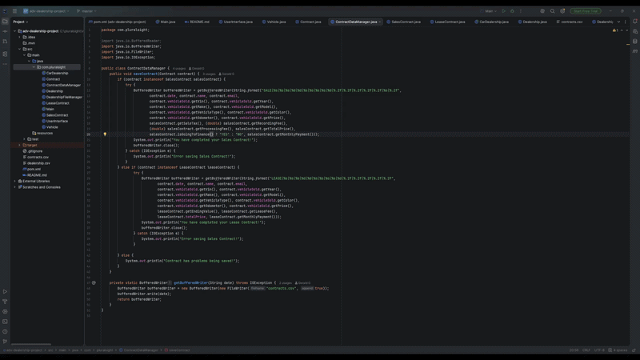

# Advance Car Dealership

## Description of the Project

This is a Java console application that simulates a car dealership experience. It is intended for customers
who want to browse available vehicles, filter by various criteria, and complete a sale or lease contract.
The application allows users to view inventory, search by price, make/model, year, color, mileage, and type,
add or remove vehicles, and sign sales or lease contracts with full pricing breakdowns. It aims to solve the
problem of providing a simple and interactive dealership experience directly from the terminal, while also
generating a contracts file saved locally for record keeping.

## User Stories

- As a customer I would like to know the date on my contract so that I can know when I sign it.
- As a customer I would like to put my name on my contract so that I can know who's contract it is.
- As a customer I would like to put my email on my contract so that I can be contacted if need be.
- As a customer I would like to put my vehicle is sold on the contract so that I can know I own it.
- As a customer I would like to know my total price in my contract so that I can know what I owe or paid off.
- As a customer I would like to establish my monthly payments on my contract so that I can know how much ill be paying.

## Setup

Instructions on how to set up and run the project using IntelliJ IDEA.

### Prerequisites

- IntelliJ IDEA: Ensure you have IntelliJ IDEA installed, which you can download from [here](https://www.jetbrains.com/idea/download/).
- Java SDK: Make sure Java SDK is installed and configured in IntelliJ.

### Running the Application in IntelliJ

Follow these steps to get your application running within IntelliJ IDEA:

1. Open IntelliJ IDEA.
2. Select "Open" and navigate to the directory where you cloned or downloaded the project.
3. After the project opens, wait for IntelliJ to index the files and set up the project.
4. Find the main class with the `public static void main(String[] args)` method.
5. Right-click on the file and select 'Run 'YourMainClassName.main()'' to start the application.

## Technologies Used

- Java: corretto-17 Amazon Corretto 17.0.18

## Demo

## Future Work

- Add a login system to track customer purchase history
- Send contract confirmation emails automatically using the customer's email
- Add support for trade-in vehicles with value deduction applied to the contract

## Resources

List resources such as tutorials, articles, or documentation that helped you during the project.

- [GitHub Resource](https://github.com/RayMaroun/yearup-spring-section-8-2026)
- [Java Visual](https://raymaroun.github.io/yearup-java-visuals/)

## Team Members

- **Gerald** - Owner

## Thanks

Express gratitude towards those who provided help, guidance, or resources:

- Thank you to Raymond for continuous support and guidance.